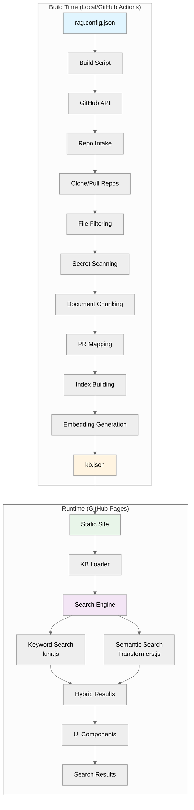
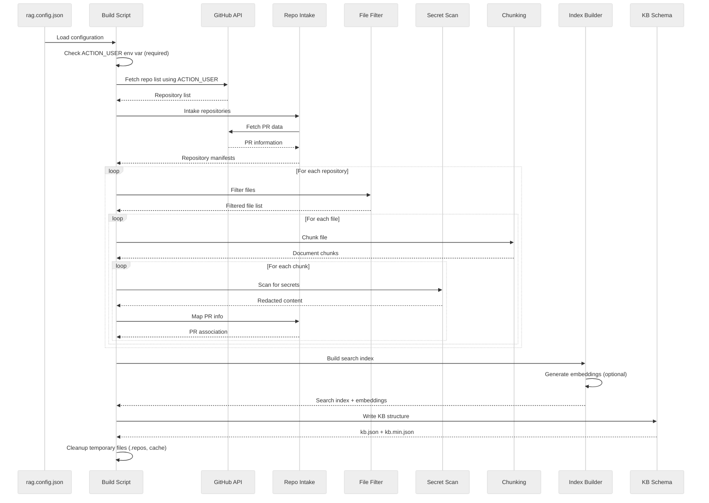
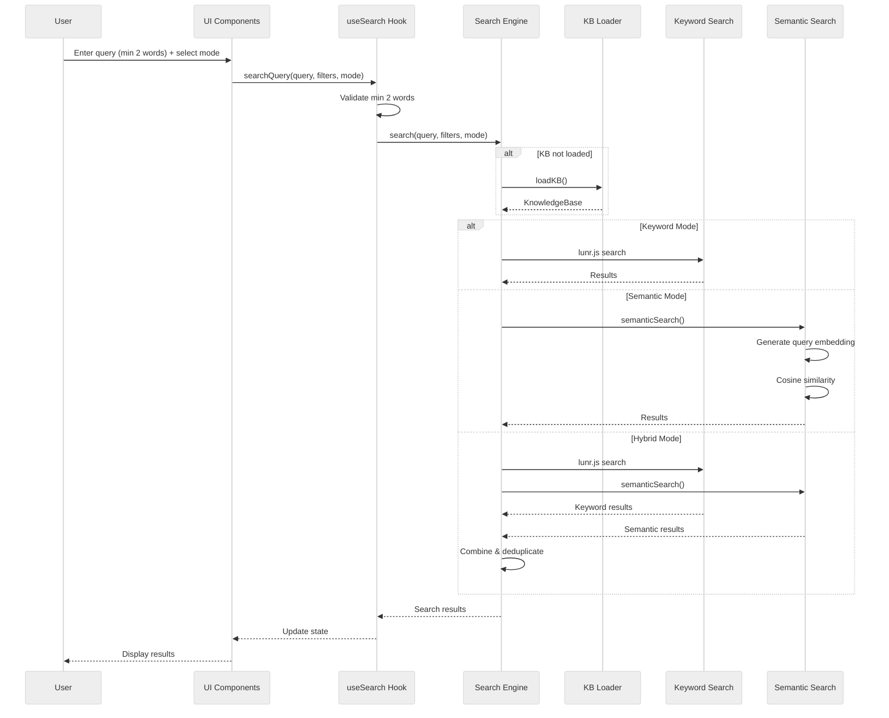
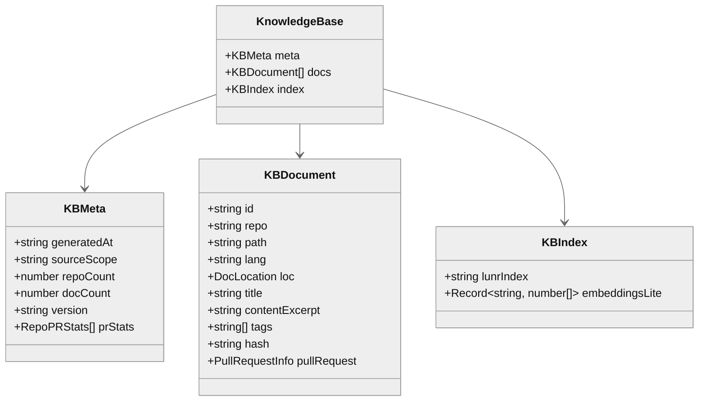

# Architecture

This document describes the architecture of the RAG Repo Harness system, including build-time and runtime components.

## System Overview

RAG Repo Harness is a static RAG (Retrieval-Augmented Generation) system that indexes GitHub repositories at build time and provides a searchable interface at runtime. The system operates in two distinct phases:

1. **Build Time**: Processes repositories, generates search indices, and creates a static knowledge base
2. **Runtime**: Provides in-browser search capabilities using pre-computed indices

## Architecture Diagram

## Build-Time Architecture

### Components

#### 1. Configuration (`rag.config.json`)

- Repository configuration (explicit repos, branches)
- Build parameters (chunk size, KB size limit, PR fetching)
- Embedding generation toggle
- GitHub username must be provided via `ACTION_USER` environment variable (not in config file)

#### 2. Build Script (`scripts/build-kb.ts`)

Orchestrates the entire build process:

- Loads configuration
- Coordinates all build modules
- Generates final knowledge base

#### 3. Repository Intake (`scripts/modules/repo-intake.ts`)

- Fetches public repository list from GitHub API (requires `ACTION_USER` env var)
- Filters repositories (only "garry-" prefix repos, excludes self-repo)
- Only indexes public repositories by default (`includePrivate: false`)
- Clones or pulls repositories
- Fetches open pull request data (numbers, titles, changed files)
- Maps files to their related PRs
- Generates repository manifests

#### 4. File Filtering (`scripts/modules/ignore-filters.ts`)

- Applies `.ragignore` patterns
- Applies `.gitignore` patterns
- Filters out excluded files and directories

#### 5. Secret Scanning (`scripts/modules/secret-scan.ts`)

- Detects secrets using regex patterns and entropy analysis
- Redacts sensitive content before indexing
- Generates security scan reports

#### 6. Document Chunking (`scripts/modules/chunking.ts`)

- Splits files into logical chunks:
  - **Markdown**: By headings
  - **Code**: By functions/classes
  - **Fallback**: By size (max 3000 chars)
- Preserves context and structure

#### 7. Index Building (`scripts/modules/index-builder.ts`)

- Creates `lunr.js` full-text search index
- Generates embeddings using `@xenova/transformers` (if enabled)
- Serializes indices for runtime use

#### 8. Knowledge Base Schema (`scripts/modules/kb-schema.ts`)

- Validates KB structure
- Writes `kb.json` and `kb.min.json`
- Ensures size limits are respected

### Build Flow

## Runtime Architecture

### Components

#### 1. KB Loader (`src/lib/search/kb-loader.ts`)

- Loads `kb.json` or `kb.min.json` from public directory
- Caches loaded KB in memory
- Validates KB structure

#### 2. Search Engine (`src/lib/search/search-engine.ts`)

- Initializes `lunr.js` index from serialized data
- Requires minimum 2 words for search queries
- Supports three search modes:
  - **Keyword**: Full-text search using `lunr.js` (always available)
  - **Semantic**: Vector similarity using embeddings (requires embeddings in KB)
  - **Hybrid**: Combines both with weighted scoring
- Applies filters (repo, language, file type, PR status, tags)

#### 3. Semantic Search (`src/lib/search/semantic-search.ts`)

- Lazy-loads `@xenova/transformers` model
- Generates query embeddings
- Calculates cosine similarity with document embeddings
- Returns ranked results

#### 4. UI Components

- **SearchBar**: Input with mode selector and filters
- **ResultsList**: Displays search results with citations
- **ResultDetail**: Shows detailed document information
- **Filters**: Repository, language, and tag filters

### Runtime Flow

## Data Flow

### Knowledge Base Structure

## Search Modes

### Search Requirements

- **Minimum Query Length**: 2 words required
- **Keyword Search**: Always available (uses `lunr.js`)
- **Semantic Search**: Requires `generateEmbeddings: true` in config
- **Hybrid Search**: Combines keyword and semantic results

### Keyword Search

- Uses `lunr.js` full-text search
- Fast, lightweight, no external dependencies
- Good for exact matches and keyword-based queries
- Field boosting: title (10x), path (5x), repo (3x), lang (2x), content (1x)

### Semantic Search

- Uses pre-computed embeddings (`Xenova/all-MiniLM-L6-v2`)
- Generates query embeddings at runtime
- Calculates cosine similarity with document embeddings
- Better for conceptual queries and semantic understanding
- Requires embeddings to be generated at build time

### Hybrid Search

- Combines keyword and semantic results
- Weighted scoring: keyword (60%), semantic (40%)
- Deduplicates results by document ID
- Provides best of both approaches

## Security Architecture

### Build-Time Security

- Secret scanning before indexing
- Content redaction for detected secrets
- Token never stored in KB
- Environment variable usage (`ACTION_TOKEN`)

### Runtime Security

- No API keys or tokens in browser
- Static site (no backend)
- Content Security Policy (CSP) headers
- Secrets already redacted in KB

## Deployment Architecture

### GitHub Actions Workflow

1. Triggered on push to main or manual trigger
2. Sets up Node.js environment
3. Installs dependencies
4. Runs `npm run build:kb` (uses `ACTION_USER` and `ACTION_TOKEN` secrets)
   - Fetches public repos from GitHub API
   - Indexes content and generates KB
   - Cleans up temporary files automatically
5. Runs `npm run build` (builds React app)
   - Cleans up temporary files automatically
6. Deploys to GitHub Pages

### GitHub Pages

- Serves static files (HTML, CSS, JS)
- Serves `kb.json` from public directory
- No server-side processing
- Fully static and cacheable

## Performance Considerations

### Build Time

- Parallel repository processing
- Efficient chunking strategies
- Embedding generation can be slow (optional)
- Size limits prevent oversized KBs

### Runtime

- Lazy loading of KB and models
- Cached KB in memory
- Efficient search algorithms
- Minimal bundle size (no heavy dependencies)

## Limitations

- **Static only**: Requires rebuild for updates
- **Size limit**: KB must be < 20MB
- **Public repos only**: Only public repositories indexed by default
- **Search minimum**: Requires at least 2 words per query
- **Embeddings**: Optional, increases build time
- **Model loading**: Semantic search requires model download on first use
- **Browser compatibility**: Requires modern browsers with WebAssembly support
